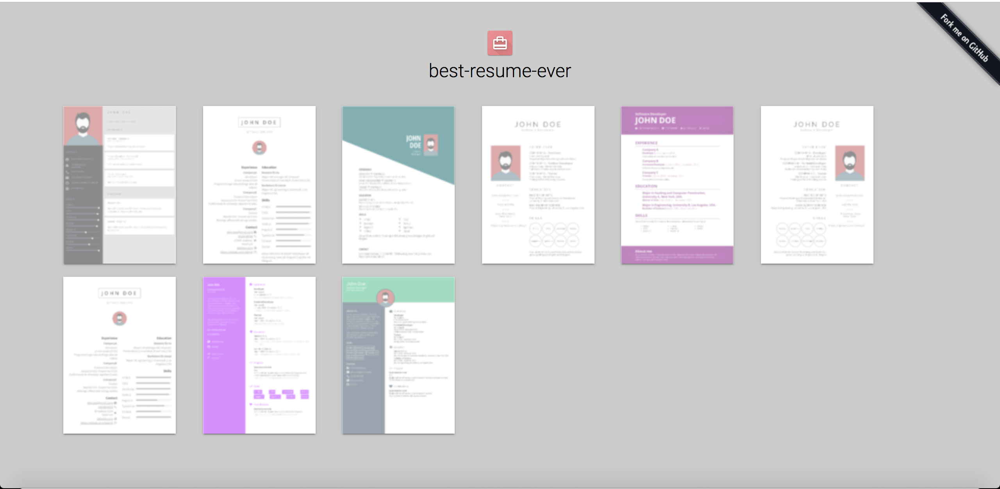

# Alexandros Soumplis CV

## General

This repository holds the necessary data to generate my CV. Processed versions of my CV are available in [PDF](https://en.wikipedia.org/wiki/PDF) format in the directory pdf of this repository. Also a manually maintained version of this CV is available in [Markdown](https://en.wikipedia.org/wiki/Markdown) format in the root folder of this repository with the name [Alexandros_Soumpis.md](Alexandros_Soumpis.md)

## Generate CV

### Prerequisite

1. It is required to have Node.js with version 8.5.0 or higher. To see what version of Node.js is installed on your machine type the following command in the terminal:

```bash
node -v
```

1. If you do not have installed Node.js in your machine then go [here](https://nodejs.org/en/download/) in order to download and install node.

### Edit

1. Clone this repository.

```bash
git clone https://github.com/soumplis/mycv
```

1. Go to the cloned directory (e.g. `cd mycv`).

1. Run `npm install` to install all node prerequisites.

1. Edit personal data in the (mycv) directory
   1. Edit personal data in (mydta.yml)
   1. Replace the default profile-picture (myid.jpg) with your picture

### Preview and Export

**Preview** the result by running `npm run dev`. The command will start a server instance and listen on port 8080. Open [http://localhost:8080/home](http://localhost:8080/home) in your browser. The page will show some CV previews. To see the preview of your CV, with your picture and data, click on one layout that you like and the CV will be opened in the same window.



**Export** your CV as pdf by running the command `npm run export`. In order to avoid errors due to the concurrency of two `npm run` commands, stop the execution of the previous `npm run dev` and then type the export command.

All CVs will be exported to the `pdf/` folder.

## Other Info

### Create new templates

Please read the [developer](DEVELOPER.md) docs</a> on how to create or update templates.

### Contribute

Feel free to add your own templates, language supports, fix bugs or improve the docs. Any kind of help is appreciated! If you make any kind of changes to an existing template, please commit them as new templates.

### Credits

This project uses several open source packages:

- [Vue](https://github.com/vuejs/vue)
- [Puppeteer](https://github.com/GoogleChrome/puppeteer)
- [LESS](https://github.com/less/less.js)

---
__The original author of this software and the generator is:__

> [sarasteiert.com](https://www.sarasteiert.com)
> Original repo [best-resume-ever](https://github.com/salomonelli/best-resume-ever/)
> GitHub [@salomonelli](https://github.com/salomonelli) &nbsp;&middot;&nbsp;
> Twitter [@salomonelli](https://twitter.com/salomonelli)

## License

[MIT](https://github.com/soumplis/mycv/blob/master/LICENCE.md)
