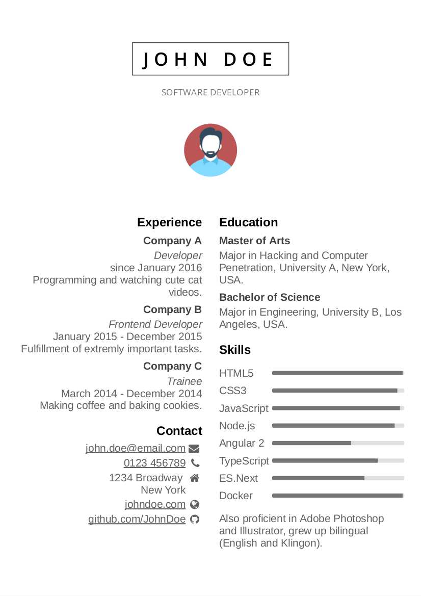
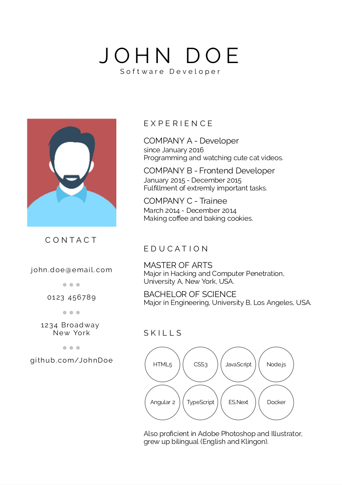
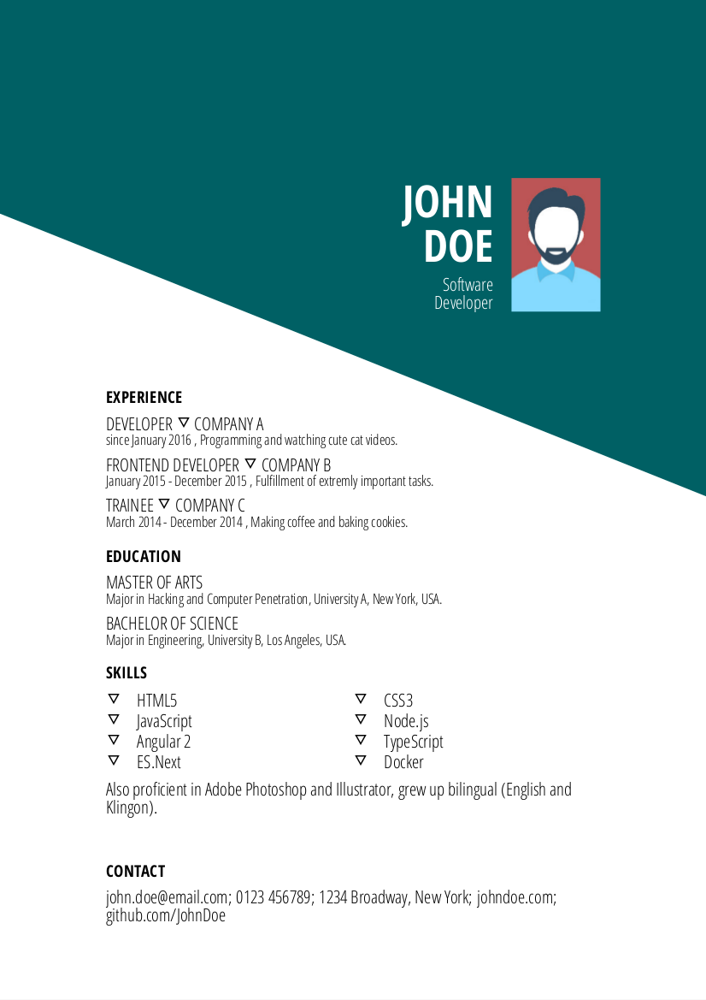
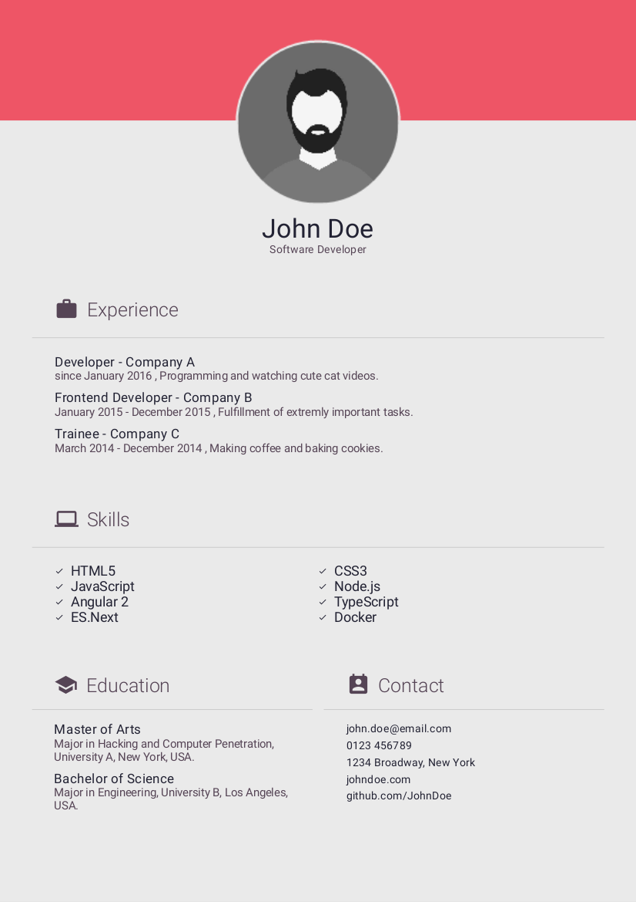
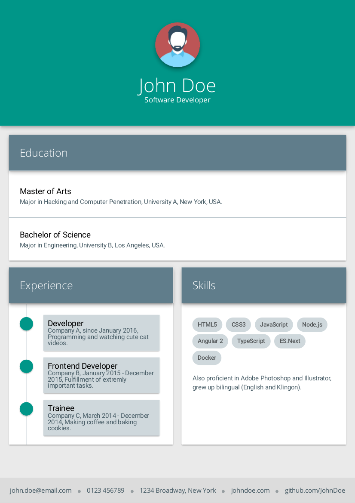
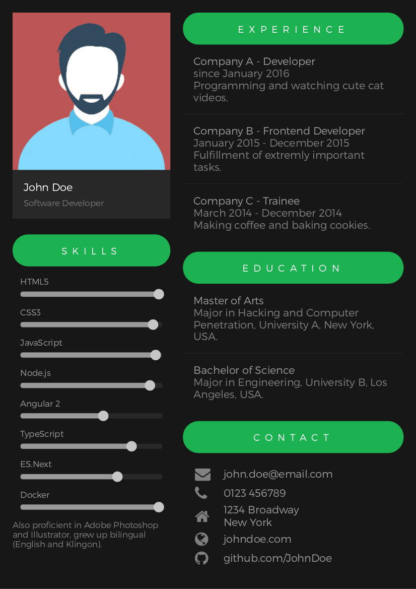

# best-resume-ever

Build your best resume ever!

A collection of multiple beautiful resumes build with LESS and Mustache Templates. Choose your favorite Curriculum Vitae and easily export it as PDF.


## Resumes

<a href="public/preview/resume-left-right.png"></a>
<a href="public/preview/resume-side-bar.png"></a>
<a href="public/preview/resume-oblique.png"></a>
<a href="public/preview/resume-wanted.png"></a>
<a href="public/preview/resume-grey-boxes.png"></a>
<a href="public/preview/resume-spotify.png"></a>

<br>

## Getting Started

Follow these instructions to set up this project and create your own CV.

<br>

### Prerequisites

To run this project, please install node. (See https://nodejs.org/en/download/package-manager/ and https://nodejs.org/en/download/)

<br>

### Installation

- Clone this repository.
- Switch to project directory and run `npm install`.

<br>

### Adjusting your personal information

- Adjust your personal information in `/src/person.js`.
- Replace placeholder image `/public/person.jpg` with your portrait.
- To preview your CV run `npm run dev`. Check out <http://localhost:3000>.

Everytime you make changes, the app recompiles automatically. This may take a short while. Feel free to adjust font-sizes and other stylings to fit your needs!

<br>

### Exporting resumes as PDF

With `npm run pdf` the resumes can be exported. You will find all resumes as PDFs in `/pdf`.

[electroshot](https://github.com/mixu/electroshot) is used to generate PDFs. `convertToPdf()` in `/src/htmlToPdf.js` runs a short bash script for each resume running under `localhost:3000/resumes/resume-X`. By default the PDF size is A4. For more PDF settings check [mixu/electroshot](https://github.com/mixu/electroshot).

<br>

### Adjusting stylings and layout

This project uses LESS. Under `/less` global stylings are defined. You will find here imported fonts and the page layout.

Each resume has its own directory. For example 'resume-1' is under `/resumes/resume-1`. Each resume directory contains a Mustache template and a less-file.

<br>

### Icons

This project contains the [Google Material](https://material.io/icons/) and [fontawesome](http://fontawesome.io/icons/) icon sets.

<br>

### CSS3 Box-Shadows

Due to this [Chrome bug](http://stackoverflow.com/questions/13975198/text-shadow-and-box-shadow-while-printing-chrome), CSS3 box-shadows are not rendered properly in the PDF files. The solution is to add this styling to elements with box-shadows:

```css
-webkit-print-color-adjust:exact;
-webkit-filter:opacity(1);
```

Unfortunately, fonts and images get blurred and lose quality. Therefore `fixBoxShadows()` in `/src/javascript.js` fixes this bug, by

1. searching for all elements with a box-shadow,
2. removing the box-shadow,
3. adding a new and absolute positioned element (with same size, position, border-radius and box-shadow) to the HTMl body,
4. and adding the stylings for `-webkit-print-color-adjust` and `-webkit-filter` to the new element.

If shadows may be displayed wrong, please check that the element with a box-shadow has a proper height, width and positioning.

<br>

### Adding fonts

To add a font to the project, search for the npm-module of the desired font, e.g. [roboto-fontface](https://www.npmjs.com/package/roboto-fontface) for 'Roboto'. Add dependency to `package.json` with `npm i --save`, e.g. `npm i --save roboto-fontface`.

Create a new less file in `/less/fonts`, e.g. 'roboto.less'. `/node_modules` are accessable through localhost:3000. That means if the corresponding woff-file is under `/node_modules/roboto-fontface/anyFont.woff` the source url needs to equal `/roboto-fontface/anyFont.woff`:

```less
@font-face {
    font-family: 'Roboto';
    src: url('/roboto-fontface/fonts/Roboto/Roboto-Thin.eot');
    src: local('Roboto Thin'), local('Roboto-Thin'), url('/roboto-fontface/fonts/Roboto/Roboto-Thin.woff') format('woff'), url('/roboto-fontface/fonts/Roboto/Roboto-Thin.ttf') format('truetype')
    font-weight: 100;
    font-style: normal;
}
```

Import new less file in `/less/fonts.less`:

```less
@import "fonts/opensans.less";
@import "fonts/montserrat.less";
@import "fonts/raleway.less";
@import "fonts/opensans-condensed.less";
@import "fonts/material-design-icons.less";
@import "fonts/roboto.less";
```

<br>

## Adding a template

Follow these steps:
- add folder in resumes, convention: 'resume-X'
- add `style.less` and `index.mustache` with same naming inside new folder

Sample content of `index.mustache`:
```html
<page class="a4">
    <div id="resume1" class="resume">
      <!-- Content goes here -->
    </div>
</page>
```

For further reference, check out existing templates.

<br>

## Contribute

Feel free to create your own templates. Please read this documentation carefully. After adding your template please add a preview of the template to the readme. Place .png in `/public/preview`. 
