<h1 align="center">
  <br>
  <a href="https://github.com/salomonelli/best-resume-ever">
  </a>
  <br>
  best-resume-ever
  <br>
</h1>

<div align="center">

[](https://travis-ci.org/salomonelli/best-resume-ever)

</div>

<h4 align="center">
  :necktie: :briefcase: Build fast :rocket: and easy multiple beautiful resumes and create your best CV ever!
  <br><br>
  Made with Vue and LESS.
</h4>

<br>
<br>

<p align="left">
<p>Cool<br>
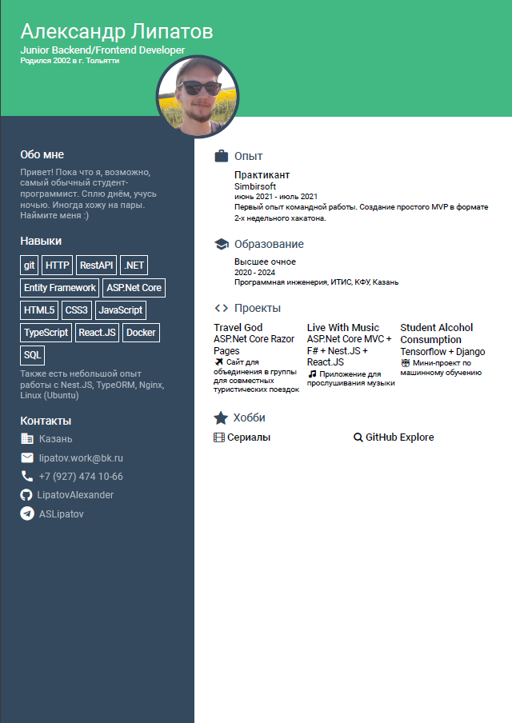
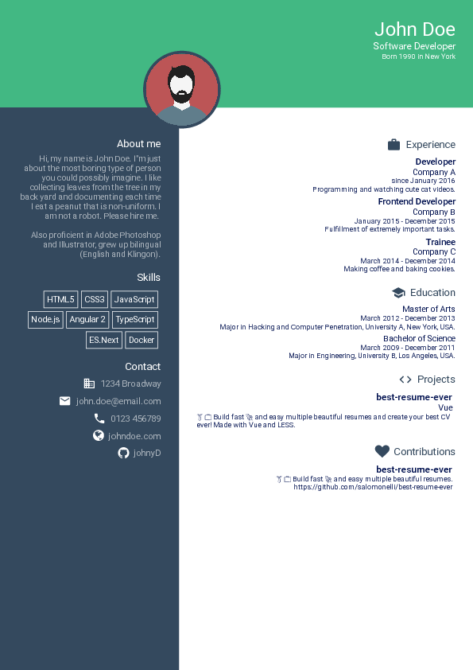
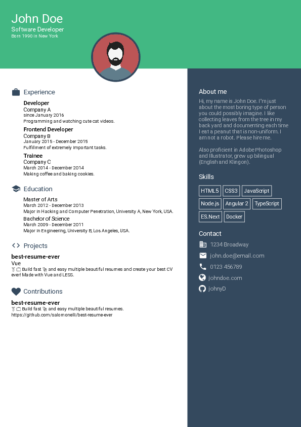
</p>
<p>Creative<br>
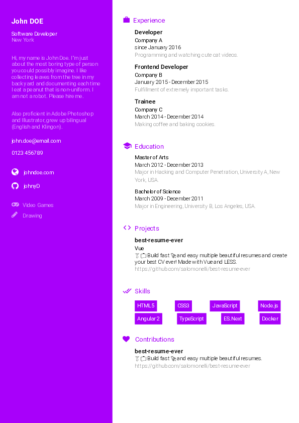
</p>
<p>Green<br>
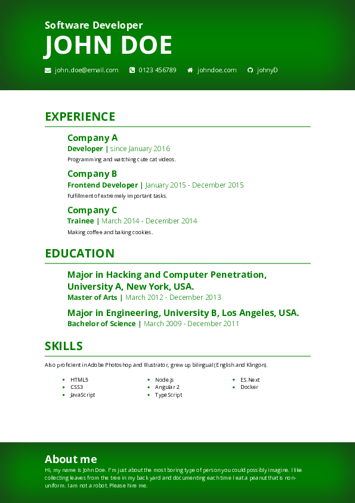
</p>
<p>Purple<br>
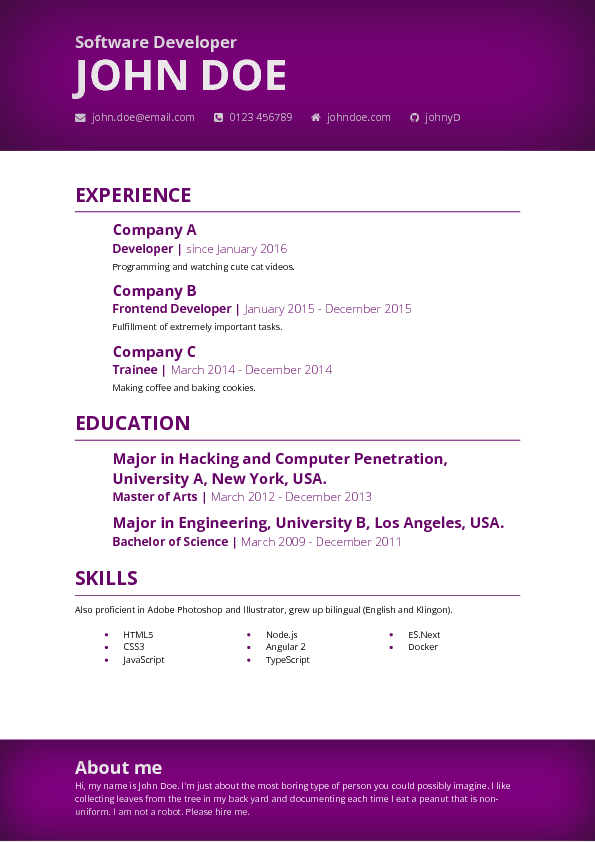
</p>
<p>Side Bar<br>
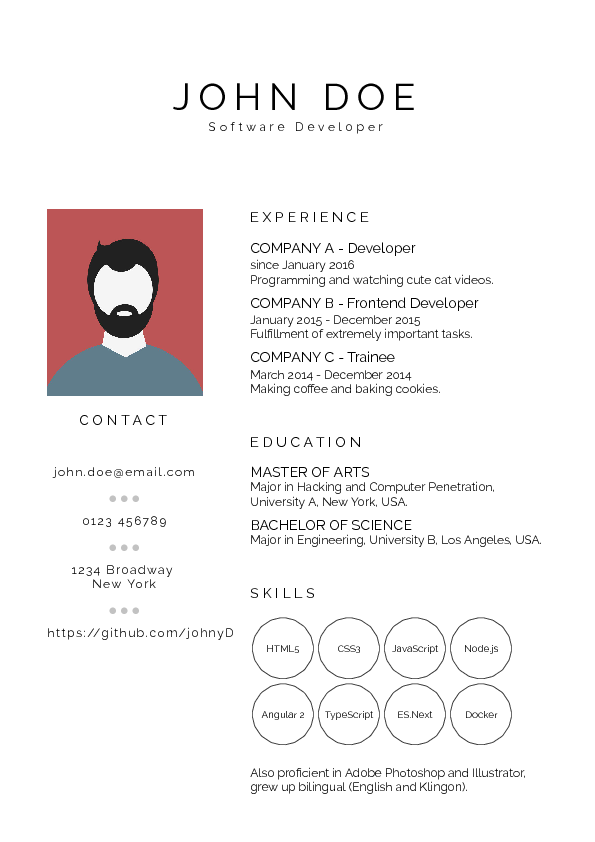

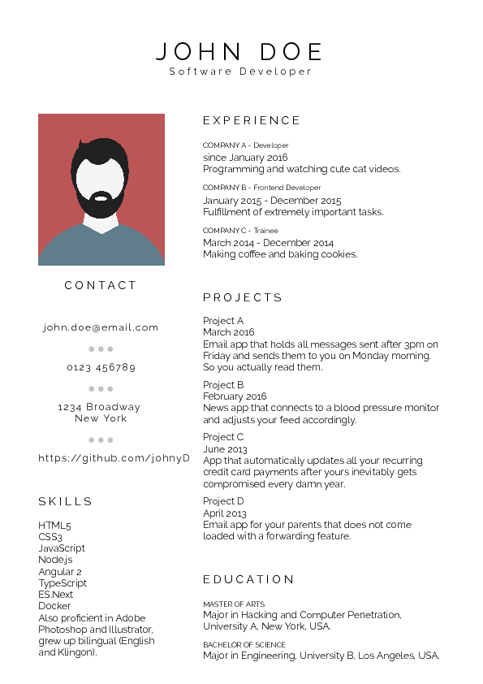
</p>
<p>Left Right<br>
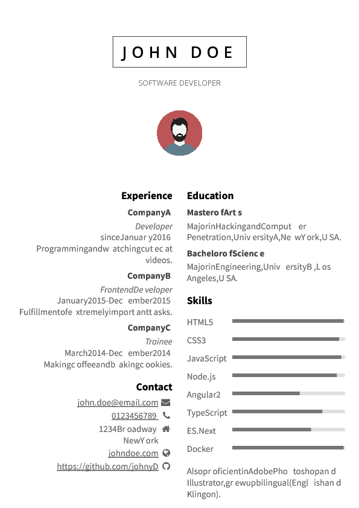
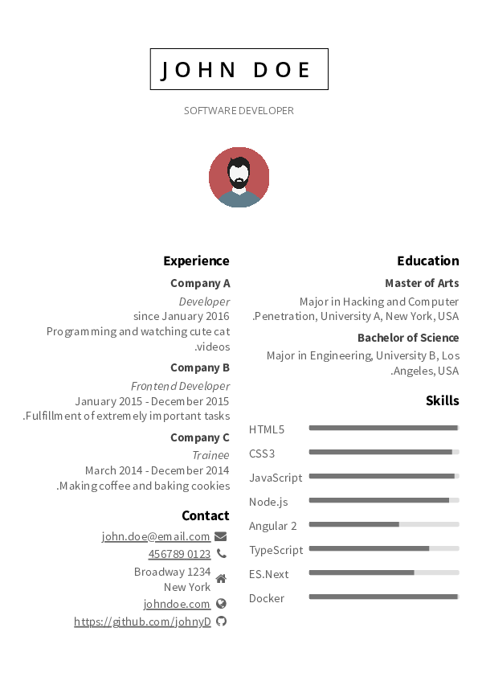
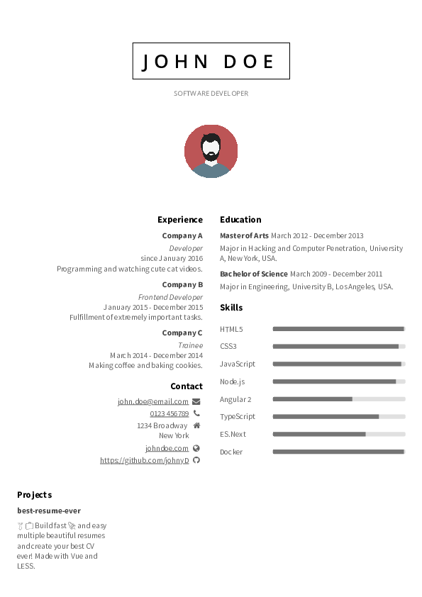
</p>
<p>Material Dark<br>
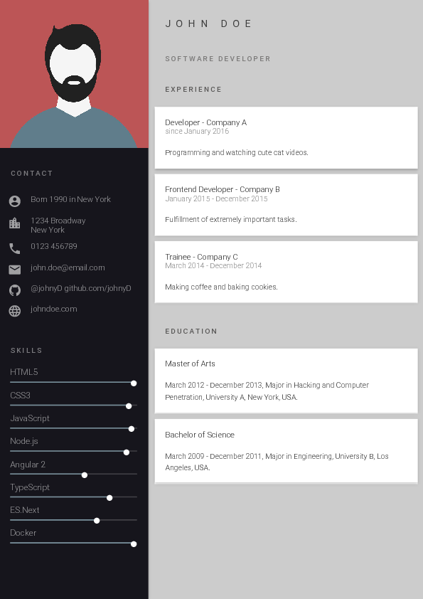
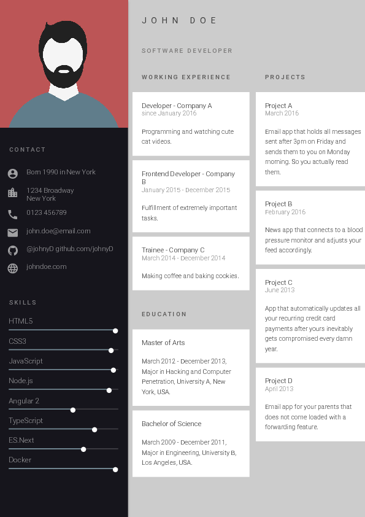
</p>
<p>Oblique<br>
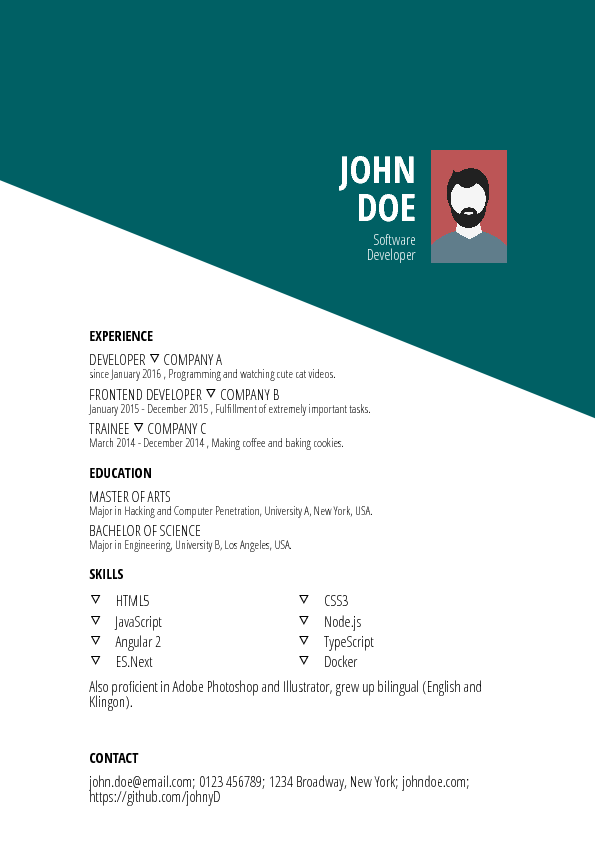
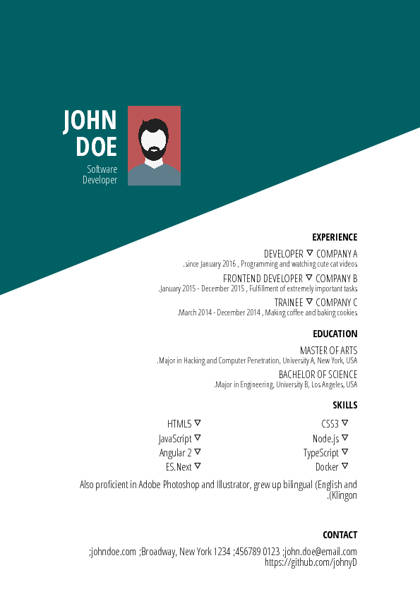
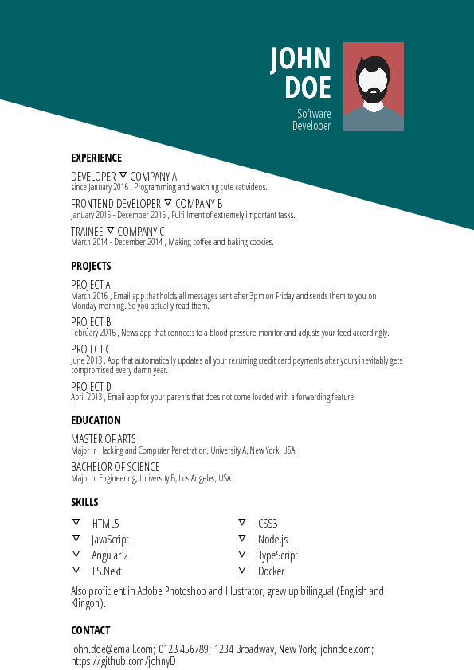
</p>
</p>

<br>
<br>


## Prerequisite

1. It is required to have Node.js with version 8.5.0 or higher. To see what version of Node.js is installed on your machine type the following command in the terminal:

```
node -v
```

2. If you do not have installed Node.js in your machine then go to [this link](https://nodejs.org/en/download/) in order to install node.

## How to use

1. Clone this repository.

```
git clone https://github.com/salomonelli/best-resume-ever.git
```

2. Go to the cloned directory (e.g. `cd best-resume-ever`).

3. Run `npm install`. This may take a few seconds.

4. Customize your resume in the `resume/` directory: edit your data `data.yml` and replace the default profile-picture `id.jpg` with your picture. Rename your picture as `id.jpg` and copy it in the `resume/` directory. During this step, you may find it easier to navigate with Finder or File Explorer to get to the files. This will allow you to edit files with your computers default text editor. 

5. Preview resumes with `npm run dev`. The command will start a server instance and listen on port 8080.  Open (http://localhost:8080/home) in your browser. The page will show some resume previews. To see the preview of your resume, with your picture and data, click on one layout that you like and the resume will be opened in the same window.


6. Export your resume as pdf by running the command `npm run export`. In order to avoid errors due to the concurrency of two  `npm run` commands, stop the execution of the previus `npm run dev` and then type the export command.

All resumes will be exported to the `pdf/` folder.

<br>

## Creating and Updating Templates

Please read the <a href="DEVELOPER.md">developer docs</a> on how to create or update templates.

<br>

## Contribute

Feel free to add your own templates, language supports, fix bugs or improve the docs. Any kind of help is appreciated! If you make any kind of changes to an existing template, please commit them as new templates.

<br>


## Sponsored by

<p align="center">
    <a href="https://rxdb.info/nodejs-database.html">
        
         <br />
         <br />
         <span>The <b>NodeJs Database</b></span>
    </a>
</p>

## Credits

This project uses several open source packages:

- <a href="https://github.com/vuejs/vue" target="_blank">Vue</a>
- <a href="https://github.com/GoogleChrome/puppeteer" target="_blank">Puppeteer</a>
- <a href="https://github.com/less/less.js" target="_blank">LESS</a>

<br>

---

> [sarasteiert.com](https://www.sarasteiert.com) &nbsp;&middot;&nbsp;
> GitHub [@salomonelli](https://github.com/salomonelli) &nbsp;&middot;&nbsp;
> Twitter [@salomonelli](https://twitter.com/salomonelli)

## License

[MIT](https://github.com/salomonelli/best-resume-ever/blob/master/LICENCE.md)
