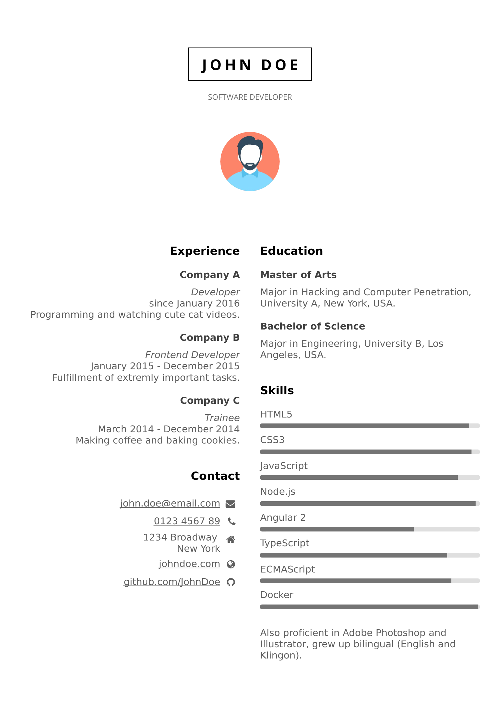

# beautifulCV

A beautiful and simple Curriculum Vitae build with HTML, CSS and JavaScript that can be generated to pdf.

See demo here: <https://salamimitpizza.github.io/beautifulCV/>

## Install

Follow these instructions to create your own CV:

- Clone this repository.
- Switch to project directory and run `npm install`.
- Run `npm run server` to preview your CV under <http://localhost:8000>.
- Adjust index.html and replace img.jpg with an image of you.
- Feel free to adjust style.css to your needs.
- When finished, run `npm run pdf` to generate the CV.pdf.

Icons made by [Vectors Market](http://www.flaticon.com/authors/vectors-market "Vectors Market") from [www.flaticon.com](http://www.flaticon.com "Flaticon") is licensed by [CC 3.0 BY](http://creativecommons.org/licenses/by/3.0/ "Creative Commons BY 3.0")
