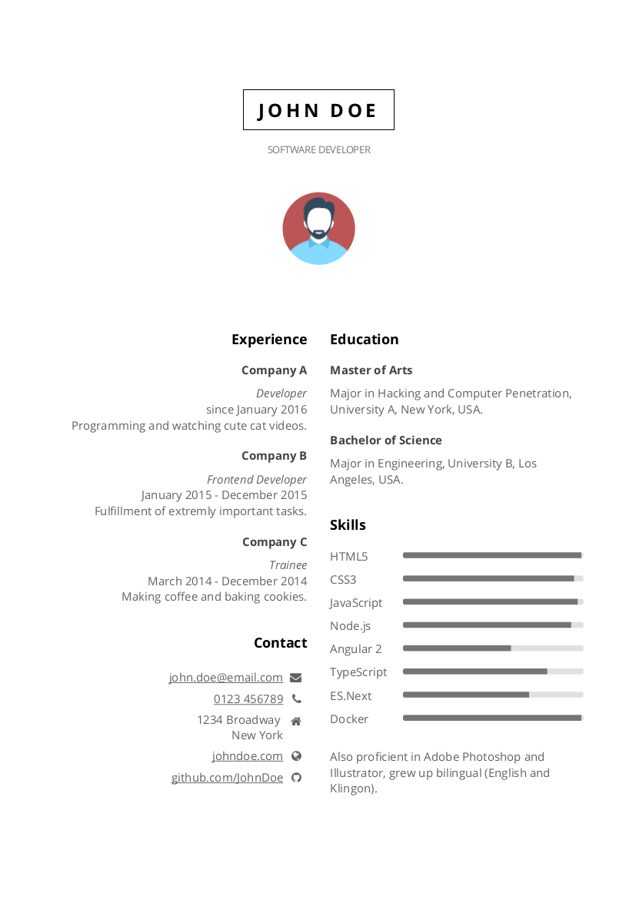
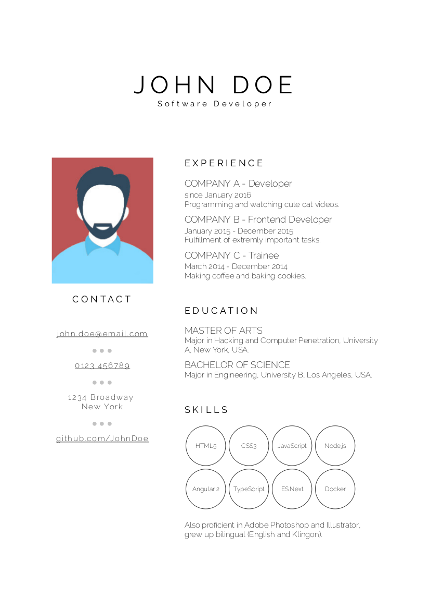
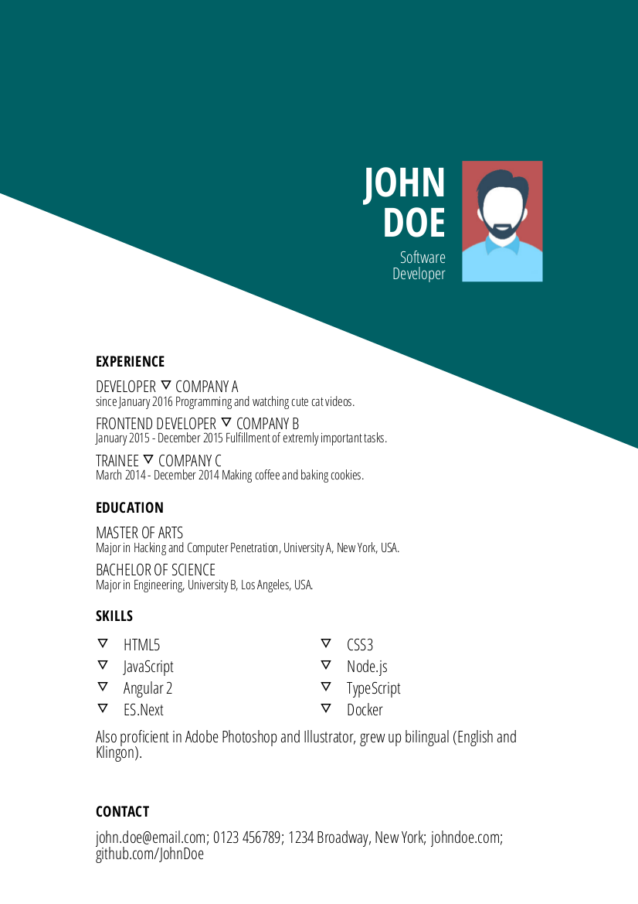

# best-resume-ever

Build your best resume ever!

A collection of beautiful resumes build with LESS and Mustache Templates. Choose your favorite Curriculum Vitae and easily export it as pdf.

## Resumes

## Install

Follow these instructions to create your own CV:

- Clone this repository.
- Switch to project directory and run `npm install`.
- Adjust your personal information in `person.js`.
- Replace placeholder image `/public/person.jpg` with your portrait.
- To preview your CV run `npm start`. Check out <http://localhost:3000>.
- Feel free to adjust styles in `/less` according to your needs.
- When finished, run `npm run pdf` to generate all CVs as pdf. You will find the generated pdfs in `/pdf`.

## Adding a template

TODO

## How to add a font

TODO

## Contribute

Feel free to create your own templates!

--------------------------------------------------------------------------------

Icons made by [Vectors Market](http://www.flaticon.com/authors/vectors-market "Vectors Market") from [www.flaticon.com](http://www.flaticon.com "Flaticon") is licensed by [CC 3.0 BY](http://creativecommons.org/licenses/by/3.0/ "Creative Commons BY 3.0")
