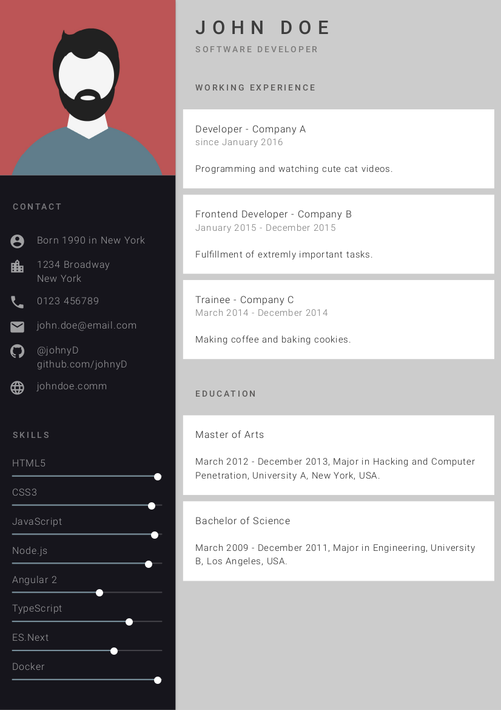

# best-resume-ever

Build your best resume ever!

A collection of multiple beautiful resumes build with LESS and Mustache Templates. Choose your favorite Curriculum Vitae and easily export it as PDF.

## Resumes

## Getting Started

Follow these instructions to set up this project and create your own CV.

### Prerequisites

To run this project, please install node. (See https://nodejs.org/en/download/package-manager/ and https://nodejs.org/en/download/)

### Installation

- Clone this repository.
- Switch to project directory and run `npm install`.

### Adjusting your personal information

- Adjust your personal information in `/src/person.js`.
- Replace placeholder image `/public/person.jpg` with your portrait.
- To preview your CV run `npm run dev`. Check out <http://localhost:3000>.

The app recompiles automatically. This may take a short while. Feel free to adjust stylings to fit your needs!

### Exporting resumes as PDF

With `npm run pdf` the resumes can be exported. You will find all resumes as PDFs in `/pdf`.

## Configuration and Contribution

Please read [the guide](/docs/Docs.md) on how to configure page size, stylings and adding your own templates.
Feel free to create your own templates or help in fixing issues. 
